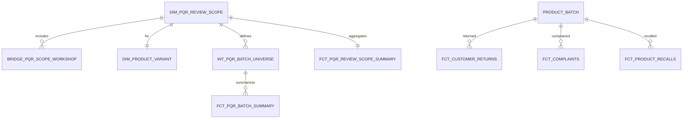

# QRS 项目：PQR（产品质量回顾）数据模型体系调整建议（多车间合并 / 多规格拆分）

> 目标：在满足 GxP 可追溯/可复算/口径可冻结 的前提下，使 PQR 报告（§1-§26）支持“多车间合并展示、按规格拆分”。

## 1. 关键结论（必须引入的新核心口径）

### 1.1 报告主键从“工单/批号”升级为“回顾范围 Scope”
- 需要显式建模 `review_scope`：**一份 PQR 报告对象 = 1 条 scope**。
- scope 必须同时满足：
  - **按规格拆分**：同一 `product_id` 不同规格/包装应输出不同 scope
  - **多车间合并**：一个 scope 可包含多个 `workshop_id`，但报告仅输出合并结果

### 1.2 建议的 Scope 维度（最小稳定集合）
- `product_id`
- `product_variant_id`（规格/包装维度；可先由 seed 过渡）
- `period_start_date` / `period_end_date`
- `version_no`（生成/冻结版本，用于审计与复算）

## 2. 推荐 ER 关系（概念模型）

## 3. 分层架构调整清单（按 dbt Layer）

### 3.1 Staging（新增/补强）
| 模型 | 目的 | 说明 |
|---|---|---|
| `stg_customer_return`（新增） | §23.2 成品退货台账 | 当前无结构化源：建议先 seed 过渡（供应链提供、QA复核），后续可切换到 `source('erp_raw','erp_customer_return')` |
|（可选）`stg_product_master`（新增） | §4 产品基本信息 | 若现有源系统无法提供规格/包装/贮存/有效期等字段，建议引入主数据表或 seed 维护 |

> 已存在且可复用：`stg_supplier_audit`、`stg_stability_study`、`stg_environment_data`、`stg_water_quality`、`stg_work_order`、`stg_production_report` 等。

### 3.2 Intermediate（新增：统一口径与桥接）
| 模型 | 目的 | 关键输出 |
|---|---|---|
| `int_pqr__batch_universe`（新增，P0） | 统一 scope 纳入批次集合 | `review_scope_id, batch_number, product_id, product_variant_id, workshop_id, batch_start_at, batch_end_at` |
| `int_pqr__scope_workshop_agg`（可选，P0） | scope 的车间集合汇总 | 仅用于展示/审计：如 `workshop_list`、`workshop_count` |
| `int_pqr__bridge_batch_environment_window`（P1） | §7 环境与批次关联 | 基于区域/线体 + 时间窗规则，输出可解释关联 |
| `int_pqr__bridge_batch_utility_window`（P1） | §6 公用系统与批次关联 | 基于取样点/系统 + 时间窗规则，输出可解释关联 |

### 3.3 Business（新增：最小化报告 SQL 复杂度）
| 模型 | 目的 | 章节覆盖 |
|---|---|---|
| `dim_product_variant`（新增，P0） | 规格/包装维度，支撑“多规格拆分” | §4 及所有按规格统计 |
| `dim_pqr_review_scope`（新增，P0） | scope 主表（周期+品种+规格+版本） | §1-§26 统一口径 |
| `bridge_pqr_scope_workshop`（新增，P0） | scope-车间多对多 | 多车间合并展示的可追溯证据 |
| `fct_pqr_review_scope_summary`（新增，P0） | scope 合并汇总指标（批数、产量、合格率、偏差等） | §1/§3/§24/§25 |
| `fct_pqr_batch_summary`（新增，P0） | 批次级宽表（用于章节清单与趋势输入） | §3/§8/§10/§12-§16/§23 |
| `fct_customer_returns`（新增，P0） | 成品退货事实 | §23.2 |
| `fct_pqr_complaint_return_recall`（新增，P0） | 统一投诉/退货/召回口径（事件级） | §23 |

> 已存在可直接引用：`fct_complaints`、`fct_product_recalls`、`fct_deviations`、`fct_capas`、`fct_inspection_results`、`fct_stability_studies`、`fct_work_orders`、`fct_production_reports`、`fct_environment_monitoring`、`fct_water_quality` 等。

### 3.4 Reports（建议重构方向）
- 现有 `pqr_summary_report.sql` 更像全局 KPI 概览；建议逐步转为“按 scope 输出的章节数据集”。
- 推荐：`rpt_pqr_scope_header`、`rpt_pqr_section_03_production`、`rpt_pqr_section_08_quality_trends`、`rpt_pqr_section_23_events` ……

## 4. 新增数据输入（Seeds / Data Contract）

### 4.1 P0 Seeds（建议立刻落地，便于 QA 审批与口径冻结）
- `seed_pqr_review_scope.csv`：scope 定义（品种/规格/周期/版本）
- `seed_pqr_scope_workshops.csv`：scope 纳入车间清单
- `seed_product_variant_map.csv`：`product_id -> product_variant_id/specification/package_form`（源缺失时过渡）
- `seed_customer_returns.csv`：成品退货台账（替代结构化源的过渡方案）

### 4.2 P1 Seeds
- `seed_process_limits.csv`：CPP/中控参数限度（建议含有效期版本）

## 5. GxP 合规与 dbt 测试要求（强制）
- 所有 `dim_*/fct_*`：主键 `unique + not_null`
- 关键外键：`relationships`（至少 `review_scope_id`、`product_variant_id`、`batch_number`）
- 所有 staging：`loaded_at not_null`
- scope 口径冻结：`dim_pqr_review_scope` 增加 `is_frozen, frozen_at, generated_at, source_loaded_at_max`
- §8 标准变更同图展示：建议对质量标准做 snapshot（SCD2）以支持“随时间变更的限度联接”。

## 6. 章节级缺口（P0 聚焦项）
- §4 产品基本信息：缺规格/包装/贮存/有效期等主数据 → `dim_product_variant`（或 `stg_product_master`）
- §23.2 成品退货：无结构化表 → `stg_customer_return` + `fct_customer_returns`
- §1-§3 汇总口径：缺 scope 实体 → `dim_pqr_review_scope` + `int_pqr__batch_universe` + `fct_pqr_review_scope_summary`

## 7. 落地路线（合并展示版，最小闭环）
1) 落地 Seeds + `dim_product_variant` + `dim_pqr_review_scope` + `bridge_pqr_scope_workshop`
2) 落地 `int_pqr__batch_universe`
3) 落地 `stg_customer_return`（seed 过渡）+ `fct_customer_returns`
4) 落地 `fct_pqr_review_scope_summary` + `fct_pqr_complaint_return_recall`
5) 逐章节补齐 P1：环境/公用系统桥接、标准 snapshot、CPP 限度

