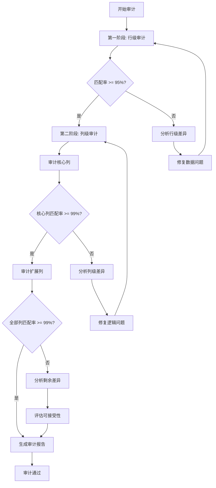

# dbt 审计跟踪系统技术实施方案

## 文档概述

**项目名称**: QRS dbt 审计跟踪系统  
**版本**: v1.0  
**创建日期**: 2024-12-24  
**目标**: 基于当前三层架构（Staging -> Intermediate -> Business）实现完整的审计跟踪解决方案

---

## 一、技术调研与分析

### 1.1 当前项目架构评估

#### 项目结构现状
- **数据库**: PostgreSQL
- **dbt 版本**: Core 1.10+
- **已安装包**: dbt_utils 1.1.1
- **模型分层**: 
  - Staging 层: 47 个模型（view 物化）
  - Intermediate 层: 2 个模型（view 物化）
  - Business 层: 39 个模型（混合物化策略）
  - Reports 层: 1 个模型（table 物化）

#### 架构优势
✅ **严格的分层架构**: 符合 dbt 最佳实践，便于审计功能集成  
✅ **完善的测试覆盖**: 已有 unique、not_null、relationships、accepted_values 测试  
✅ **标准化命名**: 遵循 snake_case 和前缀规范（stg_、fct_、dim_）  
✅ **Import CTE 模式**: 所有模型遵循标准模板，依赖关系清晰  

#### 审计需求识别
基于 QRS 项目的业务特性（制药质量管理），识别以下关键审计场景：

1. **状态变更审计**（高优先级）
   - 采购订单状态变更（待审批 → 已审批 → 进行中 → 已完成）
   - 检验状态变更（待检验 → 检验中 → 已检验）
   - 变更控制状态（草稿 → 审批中 → 已批准 → 已实施）
   - 偏差管理状态（新建 → 调查中 → 已关闭）

2. **逻辑迁移审计**（中优先级）
   - 从旧系统迁移到 dbt 模型的数据一致性验证
   - 模型重构后的数据对比验证

### 1.2 audit_helper 包核心功能分析

#### 包信息
- **包名**: dbt-labs/audit_helper
- **推荐版本**: 0.12.2（兼容 dbt Core 1.2.0 - 2.0.0）
- **核心宏**: compare_queries、compare_column_values

#### compare_queries 宏（行级对比）

**适用场景**:
- 整体数据一致性验证
- 模型重构后的全量对比
- 新旧系统数据迁移验证

**工作原理**:
```
逐行比较两个查询结果，所有列值必须完全匹配才算一致
输出: IN_A、IN_B、COUNT、PERCENT_OF_TOTAL
```

**优势**:
- 快速获得整体匹配率
- 支持灵活的列选择和业务规则
- 可以排除时区差异等已知差异列

**局限性**:
- 无法精确定位哪一列导致不匹配
- 需要主键进行行对齐（可选但推荐）

#### compare_column_values 宏（列级对比）

**适用场景**:
- 精确定位数据差异
- 逐列验证数据质量
- 调试模型重构问题

**工作原理**:
```
基于主键对齐两个表，逐列比较值的差异
输出 7 种状态: Perfect match、Both null、Missing from A/B、
Value null in A/B only、Values do not match
```

**优势**:
- 精确的列级差异报告
- 识别 NULL 值处理问题
- 识别主键不一致问题

**局限性**:
- 必须指定主键
- 一次只能比较一列（需要循环处理多列）

### 1.3 dbt Snapshots 在 Postgres 环境下的性能分析

#### Snapshots 核心机制

**SCD Type 2 实现**:
```sql
-- 快照元字段
dbt_valid_from    -- 记录生效时间
dbt_valid_to      -- 记录失效时间（当前记录为 NULL 或自定义值）
dbt_scd_id        -- 快照唯一标识
dbt_updated_at    -- 源记录更新时间
dbt_is_deleted    -- 硬删除标记（可选）
```

#### 策略对比分析

| 维度 | timestamp 策略（推荐） | check 策略 |
|------|----------------------|-----------|
| **性能** | ⭐⭐⭐⭐⭐ 仅检查单列 | ⭐⭐⭐ 需检查多列 |
| **Schema 变更适应性** | ⭐⭐⭐⭐⭐ 自动适应 | ⭐⭐ 需更新配置 |
| **数据要求** | 需要可靠的 updated_at 列 | 无特殊要求 |
| **Postgres 优化** | 易于索引优化 | 复杂索引需求 |
| **维护成本** | 低 | 中等 |

**推荐策略**: timestamp（当前项目所有表都有 create_date/update_date）

#### Postgres 性能优化策略

**1. 索引优化**
```sql
-- 复合索引（推荐）
CREATE INDEX idx_snapshot_current_records 
ON snapshot_table (unique_key, dbt_valid_to) 
WHERE dbt_valid_to IS NULL;

-- 部分索引（查询当前记录）
CREATE INDEX idx_snapshot_valid_range 
ON snapshot_table (dbt_valid_from, dbt_valid_to);
```

**2. 分区策略**（大数据量场景）
```sql
-- 按时间分区
CREATE TABLE snapshot_table (
    ...
    dbt_valid_from TIMESTAMP
) PARTITION BY RANGE (dbt_valid_from);
```

**3. VACUUM 策略**
```sql
-- 定期清理以优化性能
VACUUM ANALYZE snapshot_table;
```

---

## 二、方案设计

### 2.1 状态变更审计方案（基于 dbt Snapshots）

#### 设计原则
1. **选择性快照**: 仅对状态频繁变更的核心业务表创建快照
2. **timestamp 优先**: 利用现有 update_date 字段
3. **硬删除追踪**: 启用 hard_deletes='new_record'
4. **性能优化**: 合理设置快照运行频率

#### 快照目标表识别

**高优先级快照表**（状态变更频繁）:

| 业务域 | 源表 | 状态字段 | 快照名称 | 运行频率 |
|--------|------|---------|---------|---------|
| ERP 采购 | stg_purchase_order | order_status | snap_purchase_orders | 每日 |
| ERP 物料 | stg_material_receipt | inspection_status | snap_material_receipts | 每日 |
| LIMS 检验 | stg_inspection_request | request_status | snap_inspection_requests | 每 4 小时 |
| LIMS 检验 | stg_inspection_task | task_status | snap_inspection_tasks | 每 4 小时 |
| QMS 变更 | stg_change_control | change_status | snap_change_controls | 每日 |
| QMS 偏差 | stg_deviation | deviation_status | snap_deviations | 每日 |
| QMS CAPA | stg_capa | capa_status | snap_capas | 每日 |

**中优先级快照表**（状态变更较少）:

| 业务域 | 源表 | 状态字段 | 快照名称 | 运行频率 |
|--------|------|---------|---------|---------|
| MES 工单 | stg_work_order | work_order_status | snap_work_orders | 每日 |
| PV 投诉 | stg_complaint | complaint_status | snap_complaints | 每周 |
| SCADA 报警 | stg_alarm | alarm_status | snap_alarms | 每小时 |

#### 快照配置标准模板

**模板 1: timestamp 策略（推荐）**

```yaml
# qrs/snapshots/erp/snap_purchase_orders.yml
version: 2

snapshots:
  - name: snap_purchase_orders
    description: |
      采购订单状态变更快照 - 追踪订单从创建到完成的全生命周期状态变更

      业务价值:
      - 分析订单审批时长
      - 追踪订单状态变更历史
      - 支持合规审计要求

    relation: ref('stg_purchase_order')

    config:
      schema: snapshots
      unique_key: purchase_order_number
      strategy: timestamp
      updated_at: update_date

      # 性能优化配置
      tags: ['snapshot', 'erp', 'audit']

      # 硬删除追踪（重要！）
      hard_deletes: new_record

      # 自定义当前记录标识（推荐）
      dbt_valid_to_current: '9999-12-31'

      # 自定义元字段名称（可选，符合业务习惯）
      snapshot_meta_column_names:
        dbt_valid_from: valid_from
        dbt_valid_to: valid_to
        dbt_scd_id: snapshot_id
        dbt_updated_at: last_updated_at
        dbt_is_deleted: is_deleted

    columns:
      - name: purchase_order_number
        description: 采购订单号（主键）
        data_tests:
          - unique
          - not_null

      - name: order_status
        description: 订单状态（追踪字段）
        data_tests:
          - accepted_values:
              values: ['待审批', '已审批', '进行中', '已完成', '已取消']

      - name: valid_from
        description: 记录生效时间

      - name: valid_to
        description: 记录失效时间（9999-12-31 表示当前有效记录）

      - name: is_deleted
        description: 记录是否已被删除
```

**模板 2: check 策略（备选）**

```yaml
# qrs/snapshots/scada/snap_alarms.yml
version: 2

snapshots:
  - name: snap_alarms
    description: |
      SCADA 报警状态快照 - 追踪报警从触发到解决的状态变更

      注意: 使用 check 策略因为 update_date 不可靠

    relation: ref('stg_alarm')

    config:
      schema: snapshots
      unique_key: alarm_id
      strategy: check
      check_cols:
        - alarm_status
        - ack_by
        - resolve_by

      # 可选: 指定 updated_at 列（即使使用 check 策略）
      updated_at: alarm_time

      tags: ['snapshot', 'scada', 'audit']
      hard_deletes: new_record
      dbt_valid_to_current: '9999-12-31'
```

#### Postgres 索引优化脚本

```sql
-- qrs/macros/create_snapshot_indexes.sql


/*
    宏: create_snapshot_indexes
    描述: 为所有快照表创建性能优化索引
    使用: dbt run-operation create_snapshot_indexes
*/





-- 索引 1: 当前记录查询优化（部分索引）
CREATE INDEX IF NOT EXISTS idx_{{ snapshot }}_current
ON {{ target.schema }}_snapshots.{{ snapshot }} (unique_key)
WHERE valid_to = '9999-12-31';

-- 索引 2: 时间范围查询优化
CREATE INDEX IF NOT EXISTS idx_{{ snapshot }}_valid_range
ON {{ target.schema }}_snapshots.{{ snapshot }} (valid_from, valid_to);

-- 索引 3: 复合索引（主键 + 有效期）
CREATE INDEX IF NOT EXISTS idx_{{ snapshot }}_key_validity
ON {{ target.schema }}_snapshots.{{ snapshot }} (unique_key, valid_from DESC);

-- 索引 4: 硬删除记录查询
CREATE INDEX IF NOT EXISTS idx_{{ snapshot }}_deleted
ON {{ target.schema }}_snapshots.{{ snapshot }} (is_deleted)
WHERE is_deleted = 'True';




```

#### 快照查询辅助宏

```sql
-- qrs/macros/get_current_snapshot.sql


/*
    宏: get_current_snapshot
    描述: 获取快照表的当前有效记录或指定时间点的记录

    参数:
    - snapshot_name: 快照表名称
    - as_of_date: 可选，指定时间点（格式: 'YYYY-MM-DD'）

    示例:
    {{ get_current_snapshot('snap_purchase_orders') }}
    {{ get_current_snapshot('snap_purchase_orders', '2024-01-01') }}
*/

select *
from {{ ref(snapshot_name) }}
where
    
    valid_from <= '{{ as_of_date }}'::date
    and (valid_to > '{{ as_of_date }}'::date or valid_to = '9999-12-31')
    
    valid_to = '9999-12-31'
    
    and is_deleted = 'False'


```

```sql
-- qrs/macros/get_snapshot_history.sql


/*
    宏: get_snapshot_history
    描述: 获取指定记录的完整变更历史

    参数:
    - snapshot_name: 快照表名称
    - unique_key_value: 主键值

    示例:
    {{ get_snapshot_history('snap_purchase_orders', 'PO-2024-001') }}
*/

select
    *,
    valid_to - valid_from as duration_days,
    lead(valid_from) over (
        partition by unique_key
        order by valid_from
    ) as next_change_date
from {{ ref(snapshot_name) }}
where unique_key = '{{ unique_key_value }}'
order by valid_from desc


```

### 2.2 逻辑迁移审计方案（基于 audit_helper）

#### 设计原则
1. **增量审计**: 从核心列开始，逐步扩展到全部列
2. **分层验证**: Staging → Intermediate → Business 逐层验证
3. **自动化流程**: 使用 dbt 宏实现可复用的审计模板
4. **清晰报告**: 生成易于理解的审计报告

#### 包安装配置

```yaml
# qrs/packages.yml
packages:
  - package: dbt-labs/dbt_utils
    version: 1.1.1

  # 新增 audit_helper 包
  - package: dbt-labs/audit_helper
    version: 0.12.2
```

安装命令:
```bash
cd qrs
dbt deps
```

#### 审计模型组织结构

```
qrs/
├── analyses/                    # 审计分析模型（不物化）
│   └── audit/
│       ├── _audit.yml          # 审计模型文档
│       ├── row_audit/          # 行级审计
│       │   ├── audit_purchase_orders_rows.sql
│       │   ├── audit_inspection_requests_rows.sql
│       │   └── ...
│       └── column_audit/       # 列级审计
│           ├── audit_purchase_orders_columns.sql
│           ├── audit_inspection_requests_columns.sql
│           └── ...
└── macros/
    └── audit/
        ├── compare_model_rows.sql      # 行级对比宏
        ├── compare_model_columns.sql   # 列级对比宏
        └── generate_audit_report.sql   # 审计报告生成宏
```

#### 行级审计模板（compare_queries）

```sql
-- qrs/analyses/audit/row_audit/audit_purchase_orders_rows.sql

/*
    审计模型: audit_purchase_orders_rows
    描述: 对比旧系统采购订单表与 dbt 重构后的模型

    使用方法:
    1. 编译: dbt compile --select audit_purchase_orders_rows
    2. 查看结果: 在 target/compiled 目录查看生成的 SQL
    3. 执行: 复制 SQL 到查询工具执行
*/

{# 定义旧系统查询 #}

select
    po_number as purchase_order_number,
    supplier_id,
    po_type as order_type,
    po_status as order_status,
    order_date,
    total_amount,
    currency,
    buyer,
    create_date
from legacy_schema.purchase_orders
where order_date >= '2024-01-01'  -- 限制审计范围


{# 定义新系统查询（dbt 模型）#}

select
    purchase_order_number,
    supplier_id,
    order_type,
    order_status,
    order_date,
    total_amount,
    currency,
    buyer,
    create_date
from {{ ref('fct_purchase_orders') }}
where order_date >= '2024-01-01'


{# 执行行级对比 #}
{{ audit_helper.compare_queries(
    a_query=old_system_query,
    b_query=new_system_query,
    primary_key="purchase_order_number",
    summarize=true
) }}
```

#### 列级审计模板（compare_column_values）

```sql
-- qrs/analyses/audit/column_audit/audit_purchase_orders_columns.sql

/*
    审计模型: audit_purchase_orders_columns
    描述: 逐列对比采购订单数据质量

    策略: 增量审计
    - 第一轮: 核心业务列（订单号、金额、状态）
    - 第二轮: 扩展到关联列（供应商、物料）
    - 第三轮: 全部列
*/

{# 定义旧系统查询 #}

select
    po_number as purchase_order_number,
    total_amount,
    po_status as order_status,
    supplier_id,
    order_date
from legacy_schema.purchase_orders
where order_date >= '2024-01-01'


{# 定义新系统查询 #}

select
    purchase_order_number,
    total_amount,
    order_status,
    supplier_id,
    order_date
from {{ ref('fct_purchase_orders') }}
where order_date >= '2024-01-01'


{# 定义要审计的列 #}


{# 循环审计每一列 #}


-- ============================================
-- 审计列: {{ column }}
-- ============================================






    
    
    



```

#### 可复用审计宏

```sql
-- qrs/macros/audit/compare_model_rows.sql



/*
    宏: compare_model_rows
    描述: 通用的行级数据对比宏

    参数:
    - old_relation: 旧系统表的完整路径（schema.table）
    - new_model_ref: 新模型的 ref 名称
    - primary_key: 主键列名
    - columns_to_compare: 要对比的列列表
    - where_clause: 可选的过滤条件

    示例:
    {{ compare_model_rows(
        old_relation='legacy_schema.purchase_orders',
        new_model_ref='fct_purchase_orders',
        primary_key='purchase_order_number',
        columns_to_compare=['order_status', 'total_amount'],
        where_clause="order_date >= '2024-01-01'"
    ) }}
*/

{# 构建旧系统查询 #}

select
    
    {{ col }}{{ "," if not loop.last else "" }}
    
from {{ old_relation }}

where {{ where_clause }}



{# 构建新系统查询 #}

select
    
    {{ col }}{{ "," if not loop.last else "" }}
    
from {{ ref(new_model_ref) }}

where {{ where_clause }}



{# 执行对比 #}
{{ audit_helper.compare_queries(
    a_query=old_query,
    b_query=new_query,
    primary_key=primary_key,
    summarize=true
) }}


```

```sql
-- qrs/macros/audit/generate_audit_report.sql



/*
    宏: generate_audit_report
    描述: 生成标准化的审计报告

    参数:
    - model_name: 要审计的模型名称
    - audit_type: 审计类型（'full', 'incremental', 'core_columns'）

    输出: 审计报告表，包含以下字段
    - audit_date: 审计日期
    - model_name: 模型名称
    - audit_type: 审计类型
    - total_rows_old: 旧系统总行数
    - total_rows_new: 新系统总行数
    - matched_rows: 匹配行数
    - match_percentage: 匹配百分比
    - status: 审计状态（PASS/FAIL）
*/

with audit_metadata as (
    select
        current_timestamp as audit_date,
        '{{ model_name }}' as model_name,
        '{{ audit_type }}' as audit_type
),

-- 这里插入实际的审计逻辑
-- 可以调用 compare_queries 或 compare_column_values

audit_summary as (
    select
        count(*) as total_rows,
        sum(case when in_a and in_b then 1 else 0 end) as matched_rows,
        round(
            100.0 * sum(case when in_a and in_b then 1 else 0 end) / count(*),
            2
        ) as match_percentage
    from audit_results  -- 假设审计结果存储在此 CTE
)

select
    m.*,
    s.total_rows as total_rows_old,
    s.total_rows as total_rows_new,
    s.matched_rows,
    s.match_percentage,
    case
        when s.match_percentage >= 99.9 then 'PASS'
        when s.match_percentage >= 95.0 then 'WARNING'
        else 'FAIL'
    end as status
from audit_metadata m
cross join audit_summary s


```

#### 数据预处理标准化流程

**常见数据差异及处理方法**:

| 差异类型 | 问题描述 | 解决方案 |
|---------|---------|---------|
| **时区差异** | timestamp 列时区不一致 | 统一转换为 UTC: `at time zone 'UTC'` |
| **精度差异** | 数值列小数位数不同 | 统一精度: `round(amount, 2)` |
| **空值表示** | NULL vs 空字符串 vs 0 | 标准化: `coalesce(col, 'default')` |
| **大小写** | 字符串大小写不一致 | 统一转换: `lower(col)` 或 `upper(col)` |
| **空格** | 前后空格或多余空格 | 清理: `trim(col)` |
| **日期格式** | 日期格式不统一 | 标准化: `to_char(date_col, 'YYYY-MM-DD')` |
| **布尔值** | true/false vs 1/0 vs Y/N | 统一转换: `case when ... end` |

**数据预处理宏示例**:

```sql
-- qrs/macros/audit/standardize_for_audit.sql



/*
    宏: standardize_for_audit
    描述: 标准化列值以便审计对比

    参数:
    - column_name: 列名
    - data_type: 数据类型（'timestamp', 'numeric', 'string', 'boolean'）
*/


    {{ column_name }}::timestamp at time zone 'UTC'


    round({{ column_name }}::numeric, 2)


    trim(lower({{ column_name }}::text))


    case
        when {{ column_name }}::text in ('true', 't', '1', 'yes', 'y') then true
        when {{ column_name }}::text in ('false', 'f', '0', 'no', 'n') then false
        else null
    end


    {{ column_name }}




```

#### 审计工作流程



---

## 三、实施规范

### 3.1 命名规范

#### 快照命名规范

```
格式: snap_<source_system>_<entity>
示例:
- snap_erp_purchase_orders
- snap_lims_inspection_requests
- snap_qms_change_controls
```

#### 审计模型命名规范

```
格式: audit_<model_name>_<audit_type>
示例:
- audit_purchase_orders_rows
- audit_purchase_orders_columns
- audit_inspection_requests_full
```

#### 审计宏命名规范

```
格式: <action>_<object>
示例:
- compare_model_rows
- compare_model_columns
- generate_audit_report
- standardize_for_audit
```

### 3.2 文件组织规范

```
qrs/
├── snapshots/                   # 快照定义
│   ├── erp/                    # 按源系统组织
│   │   ├── snap_purchase_orders.yml
│   │   └── snap_material_receipts.yml
│   ├── lims/
│   │   ├── snap_inspection_requests.yml
│   │   └── snap_inspection_tasks.yml
│   ├── qms/
│   │   ├── snap_change_controls.yml
│   │   ├── snap_deviations.yml
│   │   └── snap_capas.yml
│   └── _snapshots.yml          # 快照文档索引
│
├── analyses/                    # 审计分析（不物化）
│   └── audit/
│       ├── _audit.yml
│       ├── row_audit/
│       └── column_audit/
│
└── macros/
    └── audit/
        ├── snapshot_helpers.sql
        ├── audit_helpers.sql
        └── standardization.sql
```

### 3.3 测试规范

#### 快照表测试

```yaml
# qrs/snapshots/_snapshots.yml
version: 2

snapshots:
  - name: snap_purchase_orders
    description: 采购订单状态变更快照

    data_tests:
      # 测试 1: 确保主键唯一性（在当前记录中）
      - dbt_utils.unique_combination_of_columns:
          combination_of_columns:
            - purchase_order_number
            - valid_from

      # 测试 2: 确保没有时间重叠
      - dbt_utils.expression_is_true:
          expression: "valid_from < valid_to or valid_to = '9999-12-31'"

      # 测试 3: 确保删除标记正确
      - accepted_values:
          column_name: is_deleted
          values: ['True', 'False']

    columns:
      - name: purchase_order_number
        description: 采购订单号
        data_tests:
          - not_null

      - name: valid_from
        description: 记录生效时间
        data_tests:
          - not_null

      - name: valid_to
        description: 记录失效时间
        data_tests:
          - not_null
```

#### 审计质量测试

```sql
-- qrs/tests/audit/test_snapshot_integrity.sql

/*
    测试: test_snapshot_integrity
    描述: 验证快照表的数据完整性

    失败条件:
    - 存在时间重叠的记录
    - 存在 valid_from > valid_to 的记录（除了当前记录）
    - 存在孤儿记录（主键在源表中不存在）
*/

with snapshot_data as (
    select * from {{ ref('snap_purchase_orders') }}
),

-- 检查时间重叠
time_overlaps as (
    select
        s1.purchase_order_number,
        s1.valid_from as valid_from_1,
        s1.valid_to as valid_to_1,
        s2.valid_from as valid_from_2,
        s2.valid_to as valid_to_2
    from snapshot_data s1
    join snapshot_data s2
        on s1.purchase_order_number = s2.purchase_order_number
        and s1.snapshot_id != s2.snapshot_id
    where
        s1.valid_from < s2.valid_to
        and s2.valid_from < s1.valid_to
        and s1.valid_to != '9999-12-31'
        and s2.valid_to != '9999-12-31'
),

-- 检查时间逻辑错误
time_logic_errors as (
    select *
    from snapshot_data
    where
        valid_from >= valid_to
        and valid_to != '9999-12-31'
),

-- 合并所有错误
all_errors as (
    select 'time_overlap' as error_type, purchase_order_number
    from time_overlaps

    union all

    select 'time_logic_error' as error_type, purchase_order_number
    from time_logic_errors
)

select * from all_errors
```

### 3.4 SQL 编码规范（审计模型）

遵循项目标准模板:

```sql
/*
    Model: audit_<model_name>_<type>
    Description: <审计目的和范围>

    审计配置:
    - 旧系统: <源表路径>
    - 新系统: <dbt 模型>
    - 主键: <主键列>
    - 审计列: <列列表>
    - 过滤条件: <where 子句>

    预期结果:
    - 匹配率目标: >= 99%
    - 可接受差异: <说明>
*/

-- 1. Import CTEs: 显式声明所有依赖
with old_system_data as (
    select * from legacy_schema.table_name
),

new_system_data as (
    select * from {{ ref('model_name') }}
),

-- 2. Logic CTEs: 数据标准化
standardized_old as (
    select
        {{ standardize_for_audit('column1', 'timestamp') }} as column1,
        {{ standardize_for_audit('column2', 'numeric') }} as column2
    from old_system_data
),

standardized_new as (
    select
        {{ standardize_for_audit('column1', 'timestamp') }} as column1,
        {{ standardize_for_audit('column2', 'numeric') }} as column2
    from new_system_data
),

-- 3. Audit CTE: 执行审计逻辑
audit_results as (
    {{ audit_helper.compare_queries(
        a_query='select * from standardized_old',
        b_query='select * from standardized_new',
        primary_key='id'
    ) }}
)

-- 4. Output: 必须选择 Final CTE
select * from audit_results
```

### 3.5 YAML 配置文件模板

#### 快照配置完整示例

```yaml
# qrs/snapshots/erp/snap_purchase_orders.yml
version: 2

snapshots:
  - name: snap_purchase_orders
    description: |
      **业务模型**: 采购订单状态变更快照

      **业务价值**:
      - 追踪订单从创建到完成的全生命周期
      - 分析订单审批时长和处理效率
      - 支持 GMP 合规审计要求
      - 识别订单状态异常变更

      **数据粒度**: 每行代表采购订单在特定时间段的状态

      **更新频率**: 每日 02:00 UTC

      **数据保留**: 永久保留（合规要求）

    relation: ref('stg_purchase_order')

    config:
      schema: snapshots
      database: "{{ target.database }}"

      # 快照策略配置
      unique_key: purchase_order_number
      strategy: timestamp
      updated_at: update_date

      # 硬删除追踪
      hard_deletes: new_record

      # 当前记录标识
      dbt_valid_to_current: '9999-12-31'

      # 自定义元字段名称
      snapshot_meta_column_names:
        dbt_valid_from: valid_from
        dbt_valid_to: valid_to
        dbt_scd_id: snapshot_id
        dbt_updated_at: last_updated_at
        dbt_is_deleted: is_deleted

      # 标签
      tags: ['snapshot', 'erp', 'audit', 'compliance']

      # 性能优化（Postgres 特定）
      post-hook:
        - "CREATE INDEX IF NOT EXISTS idx_{{ this.name }}_current
           ON {{ this }} (purchase_order_number)
           WHERE valid_to = '9999-12-31'"
        - "CREATE INDEX IF NOT EXISTS idx_{{ this.name }}_valid_range
           ON {{ this }} (valid_from, valid_to)"
        - "ANALYZE {{ this }}"

    columns:
      - name: purchase_order_number
        description: 采购订单号（业务主键）
        data_tests:
          - not_null

      - name: order_status
        description: |
          订单状态（追踪字段）
          - 待审批: 订单已创建，等待审批
          - 已审批: 订单已通过审批
          - 进行中: 订单正在执行
          - 已完成: 订单已完成
          - 已取消: 订单已取消
        data_tests:
          - not_null
          - accepted_values:
              values: ['待审批', '已审批', '进行中', '已完成', '已取消']

      - name: supplier_id
        description: 供应商ID
        data_tests:
          - not_null
          - relationships:
              to: ref('stg_supplier_master')
              field: supplier_id

      - name: total_amount
        description: 订单总金额
        data_tests:
          - not_null
          - dbt_utils.expression_is_true:
              expression: ">= 0"

      - name: valid_from
        description: 记录生效时间（SCD Type 2）
        data_tests:
          - not_null

      - name: valid_to
        description: |
          记录失效时间（SCD Type 2）
          - 9999-12-31: 当前有效记录
          - 其他日期: 历史记录的失效时间
        data_tests:
          - not_null

      - name: snapshot_id
        description: 快照记录唯一标识（dbt 内部使用）
        data_tests:
          - unique
          - not_null

      - name: last_updated_at
        description: 源记录最后更新时间
        data_tests:
          - not_null

      - name: is_deleted
        description: |
          记录删除标记
          - False: 正常记录
          - True: 已删除记录
        data_tests:
          - not_null
          - accepted_values:
              values: ['True', 'False']
```

#### 审计模型文档示例

```yaml
# qrs/analyses/audit/_audit.yml
version: 2

analyses:
  - name: audit_purchase_orders_rows
    description: |
      **审计类型**: 行级数据对比

      **审计目标**: 验证 fct_purchase_orders 模型与旧系统数据的一致性

      **审计范围**:
      - 时间范围: 2024-01-01 至今
      - 数据量: 约 50,000 条记录

      **审计列**:
      - purchase_order_number (主键)
      - supplier_id
      - order_type
      - order_status
      - order_date
      - total_amount
      - currency
      - buyer
      - create_date

      **预期结果**:
      - 匹配率目标: >= 99.5%
      - 可接受差异: 时区差异、精度差异

      **执行方法**:
      ```bash
      dbt compile --select audit_purchase_orders_rows
      # 然后在查询工具中执行生成的 SQL
      ```

      **结果解读**:
      - IN_A=TRUE, IN_B=TRUE: 完全匹配的记录
      - IN_A=TRUE, IN_B=FALSE: 仅在旧系统存在
      - IN_A=FALSE, IN_B=TRUE: 仅在新系统存在

    config:
      tags: ['audit', 'row_comparison', 'erp']

  - name: audit_purchase_orders_columns
    description: |
      **审计类型**: 列级数据对比

      **审计目标**: 逐列验证数据质量，精确定位差异

      **审计策略**: 增量审计
      1. 第一轮: 核心业务列（total_amount, order_status）
      2. 第二轮: 关联列（supplier_id, order_date）
      3. 第三轮: 全部列

      **输出指标**:
      - Perfect match: 完全匹配的记录数
      - Both are null: 两边都为 NULL 的记录数
      - Values do not match: 值不匹配的记录数
      - Missing from A/B: 缺失记录数
      - Value is null in A/B only: 单边 NULL 记录数

      **执行方法**:
      ```bash
      dbt compile --select audit_purchase_orders_columns
      # 查看终端输出的审计报告
      ```

    config:
      tags: ['audit', 'column_comparison', 'erp']
```

---

## 四、性能优化与监控

### 4.1 Postgres 快照性能优化

#### 索引策略

```sql
-- qrs/macros/audit/create_snapshot_indexes.sql



/*
    宏: create_snapshot_indexes
    描述: 为所有快照表创建优化索引

    使用方法:
    dbt run-operation create_snapshot_indexes

    索引策略:
    1. 当前记录部分索引（最常用查询）
    2. 时间范围复合索引（历史查询）
    3. 主键 + 时间复合索引（点查询）
    4. 删除记录部分索引（审计查询）
*/









-- ============================================
-- 快照表: {{ table }}
-- ============================================

-- 索引 1: 当前记录查询优化（部分索引，最高优先级）
CREATE INDEX IF NOT EXISTS idx_{{ table }}_current
ON {{ schema }}.{{ table }} ({{ key }})
WHERE valid_to = '9999-12-31' AND is_deleted = 'False';

-- 索引 2: 时间范围查询优化（历史分析）
CREATE INDEX IF NOT EXISTS idx_{{ table }}_valid_range
ON {{ schema }}.{{ table }} (valid_from DESC, valid_to DESC);

-- 索引 3: 主键 + 时间复合索引（点查询优化）
CREATE INDEX IF NOT EXISTS idx_{{ table }}_key_time
ON {{ schema }}.{{ table }} ({{ key }}, valid_from DESC);

-- 索引 4: 删除记录查询（审计需求）
CREATE INDEX IF NOT EXISTS idx_{{ table }}_deleted
ON {{ schema }}.{{ table }} ({{ key }}, valid_from)
WHERE is_deleted = 'True';

-- 索引 5: 状态变更分析（如果有状态列）

CREATE INDEX IF NOT EXISTS idx_{{ table }}_status_changes
ON {{ schema }}.{{ table }} ({{ snapshot.status }}, valid_from);


-- 更新表统计信息
ANALYZE {{ schema }}.{{ table }};









```

#### 分区策略（大数据量场景）

```sql
-- qrs/macros/audit/create_partitioned_snapshot.sql



/*
    宏: create_partitioned_snapshot
    描述: 创建分区快照表（适用于超大数据量）

    参数:
    - snapshot_name: 快照表名称
    - partition_column: 分区列（默认 valid_from）

    分区策略: 按月分区

    使用场景:
    - 单表记录数 > 1000 万
    - 历史数据查询频繁
    - 需要定期归档旧数据
*/

-- 创建分区主表
CREATE TABLE IF NOT EXISTS {{ target.schema }}_snapshots.{{ snapshot_name }} (
    LIKE {{ target.schema }}_snapshots.{{ snapshot_name }}_temp
) PARTITION BY RANGE ({{ partition_column }});

-- 创建分区（最近 12 个月 + 未来分区）


{% set partition_name = snapshot_name ~ '_' ~ partition_date.strftime('%Y%m') %}
{% set start_date = partition_date.strftime('%Y-%m-01') %}
{% set end_date = (partition_date + modules.datetime.timedelta(days=32)).strftime('%Y-%m-01') %}

CREATE TABLE IF NOT EXISTS {{ target.schema }}_snapshots.{{ partition_name }}
PARTITION OF {{ target.schema }}_snapshots.{{ snapshot_name }}
FOR VALUES FROM ('{{ start_date }}') TO ('{{ end_date }}');



-- 创建默认分区（捕获未来数据）
CREATE TABLE IF NOT EXISTS {{ target.schema }}_snapshots.{{ snapshot_name }}_default
PARTITION OF {{ target.schema }}_snapshots.{{ snapshot_name }}
DEFAULT;


```

### 4.2 监控指标

#### 快照性能监控

```sql
-- qrs/models/monitoring/snapshot_performance_metrics.sql

{{
    config(
        materialized='view',
        tags=['monitoring', 'snapshot']
    )
}}

/*
    Model: snapshot_performance_metrics
    Description: 快照表性能监控指标
*/

with snapshot_tables as (
    select
        schemaname,
        tablename,
        pg_size_pretty(pg_total_relation_size(schemaname||'.'||tablename)) as total_size,
        pg_size_pretty(pg_relation_size(schemaname||'.'||tablename)) as table_size,
        pg_size_pretty(pg_indexes_size(schemaname||'.'||tablename)) as indexes_size,
        n_live_tup as row_count,
        n_dead_tup as dead_rows,
        round(100.0 * n_dead_tup / nullif(n_live_tup + n_dead_tup, 0), 2) as bloat_percentage,
        last_vacuum,
        last_autovacuum,
        last_analyze,
        last_autoanalyze
    from pg_stat_user_tables
    where schemaname like '%snapshots%'
),

snapshot_metrics as (
    select
        tablename as snapshot_name,
        total_size,
        table_size,
        indexes_size,
        row_count,
        dead_rows,
        bloat_percentage,
        case
            when bloat_percentage > 20 then 'CRITICAL'
            when bloat_percentage > 10 then 'WARNING'
            else 'OK'
        end as bloat_status,
        case
            when last_vacuum is null and last_autovacuum is null then 'NEVER'
            when coalesce(last_vacuum, last_autovacuum) < current_date - interval '7 days' then 'OVERDUE'
            else 'OK'
        end as vacuum_status,
        coalesce(last_vacuum, last_autovacuum) as last_vacuum_date,
        coalesce(last_analyze, last_autoanalyze) as last_analyze_date
    from snapshot_tables
)

select
    snapshot_name,
    total_size,
    table_size,
    indexes_size,
    row_count,
    dead_rows,
    bloat_percentage,
    bloat_status,
    vacuum_status,
    last_vacuum_date,
    last_analyze_date,
    case
        when bloat_status = 'CRITICAL' or vacuum_status = 'OVERDUE' then 'ACTION_REQUIRED'
        when bloat_status = 'WARNING' then 'MONITOR'
        else 'HEALTHY'
    end as overall_health
from snapshot_metrics
order by row_count desc
```

#### 审计质量监控

```sql
-- qrs/models/monitoring/audit_quality_metrics.sql

{{
    config(
        materialized='table',
        tags=['monitoring', 'audit']
    )
}}

/*
    Model: audit_quality_metrics
    Description: 审计执行质量监控
*/

with audit_execution_log as (
    -- 假设有审计执行日志表
    select
        audit_date,
        model_name,
        audit_type,
        total_rows_compared,
        matched_rows,
        match_percentage,
        execution_time_seconds,
        status
    from {{ ref('audit_execution_history') }}
    where audit_date >= current_date - interval '30 days'
),

quality_metrics as (
    select
        model_name,
        count(*) as total_audits,
        count(case when status = 'PASS' then 1 end) as passed_audits,
        count(case when status = 'FAIL' then 1 end) as failed_audits,
        round(avg(match_percentage), 2) as avg_match_percentage,
        min(match_percentage) as min_match_percentage,
        max(match_percentage) as max_match_percentage,
        round(avg(execution_time_seconds), 2) as avg_execution_time,
        max(audit_date) as last_audit_date
    from audit_execution_log
    group by model_name
)

select
    model_name,
    total_audits,
    passed_audits,
    failed_audits,
    round(100.0 * passed_audits / nullif(total_audits, 0), 2) as pass_rate,
    avg_match_percentage,
    min_match_percentage,
    max_match_percentage,
    avg_execution_time,
    last_audit_date,
    current_date - last_audit_date::date as days_since_last_audit,
    case
        when current_date - last_audit_date::date > 7 then 'OVERDUE'
        when min_match_percentage < 95.0 then 'QUALITY_ISSUE'
        when pass_rate < 80.0 then 'RELIABILITY_ISSUE'
        else 'HEALTHY'
    end as health_status
from quality_metrics
order by
    case health_status
        when 'OVERDUE' then 1
        when 'QUALITY_ISSUE' then 2
        when 'RELIABILITY_ISSUE' then 3
        else 4
    end,
    model_name
```

### 4.3 维护策略

#### 定期维护任务

```sql
-- qrs/macros/audit/maintain_snapshots.sql



/*
    宏: maintain_snapshots
    描述: 快照表定期维护任务

    维护内容:
    1. VACUUM ANALYZE（清理死行，更新统计信息）
    2. 重建膨胀的索引
    3. 归档旧数据（可选）

    执行频率: 每周一次

    使用方法:
    dbt run-operation maintain_snapshots
*/

{% set snapshots = dbt_utils.get_relations_by_pattern(
    schema_pattern='%snapshots%',
    table_pattern='snap_%'
) %}





-- 1. VACUUM ANALYZE
VACUUM ANALYZE {{ snapshot }};

-- 2. 检查索引膨胀并重建
DO $$
DECLARE
    idx record;
BEGIN
    FOR idx IN
        SELECT indexrelname
        FROM pg_stat_user_indexes
        WHERE schemaname = '{{ snapshot.schema }}'
          AND relname = '{{ snapshot.name }}'
          AND idx_scan = 0  -- 未使用的索引
    LOOP
        EXECUTE 'REINDEX INDEX CONCURRENTLY ' || idx.indexrelname;
    END LOOP;
END $$;

-- 3. 更新表统计信息
ANALYZE {{ snapshot }};









```

#### 数据归档策略

```sql
-- qrs/macros/audit/archive_old_snapshots.sql



/*
    宏: archive_old_snapshots
    描述: 归档超过保留期的快照数据

    参数:
    - retention_years: 数据保留年限（默认 7 年，符合 GMP 要求）

    归档策略:
    1. 将旧数据移动到归档表
    2. 从主表删除旧数据
    3. 压缩归档表

    使用方法:
    dbt run-operation archive_old_snapshots --args '{retention_years: 7}'
*/









-- 创建归档表（如果不存在）
CREATE TABLE IF NOT EXISTS {{ target.schema }}_archive.{{ snapshot }}
(LIKE {{ target.schema }}_snapshots.{{ snapshot }} INCLUDING ALL);

-- 移动旧数据到归档表
INSERT INTO {{ target.schema }}_archive.{{ snapshot }}
SELECT * FROM {{ target.schema }}_snapshots.{{ snapshot }}
WHERE valid_to < '{{ cutoff_date }}'::date
  AND valid_to != '9999-12-31'
ON CONFLICT DO NOTHING;

-- 从主表删除已归档数据
DELETE FROM {{ target.schema }}_snapshots.{{ snapshot }}
WHERE valid_to < '{{ cutoff_date }}'::date
  AND valid_to != '9999-12-31';

-- 压缩归档表（Postgres 不支持原生压缩，使用 TOAST）
VACUUM FULL {{ target.schema }}_archive.{{ snapshot }};






```

---

## 五、实施计划与路线图

### 5.1 实施阶段

#### 第一阶段: 基础设施准备（1-2 周）

**任务清单**:

- [ ] 安装 audit_helper 包
  ```bash
  # 更新 qrs/packages.yml
  # 运行 dbt deps
  ```

- [ ] 创建快照 Schema
  ```sql
  CREATE SCHEMA IF NOT EXISTS qrs_snapshots;
  CREATE SCHEMA IF NOT EXISTS qrs_archive;
  ```

- [ ] 创建审计宏目录结构
  ```bash
  mkdir -p qrs/macros/audit
  mkdir -p qrs/analyses/audit/row_audit
  mkdir -p qrs/analyses/audit/column_audit
  ```

- [ ] 开发核心审计宏
  - [ ] standardize_for_audit.sql
  - [ ] compare_model_rows.sql
  - [ ] compare_model_columns.sql
  - [ ] get_current_snapshot.sql
  - [ ] get_snapshot_history.sql

- [ ] 配置 dbt_project.yml
  ```yaml
  snapshots:
    qrs:
      +schema: snapshots
      +tags: ['snapshot']
  ```

**验收标准**:
- ✅ audit_helper 包成功安装
- ✅ 所有宏编译通过
- ✅ Schema 创建成功

#### 第二阶段: 快照实施（2-3 周）

**任务清单**:

**Week 1: 高优先级快照**
- [ ] 实施 snap_purchase_orders
  - [ ] 创建快照配置文件
  - [ ] 首次运行快照
  - [ ] 创建索引
  - [ ] 编写测试
  - [ ] 验证数据质量

- [ ] 实施 snap_inspection_requests
- [ ] 实施 snap_inspection_tasks

**Week 2: 中优先级快照**
- [ ] 实施 snap_change_controls
- [ ] 实施 snap_deviations
- [ ] 实施 snap_capas
- [ ] 实施 snap_material_receipts

**Week 3: 优化与监控**
- [ ] 创建性能监控模型
- [ ] 配置快照调度（dbt Cloud 或 Airflow）
- [ ] 文档编写

**验收标准**:
- ✅ 所有快照表成功创建
- ✅ 快照测试全部通过
- ✅ 性能指标符合预期（查询 < 1s）

#### 第三阶段: 审计实施（2-3 周）

**任务清单**:

**Week 1: 行级审计**
- [ ] 开发采购订单行级审计
  - [ ] 编写审计 SQL
  - [ ] 执行审计
  - [ ] 分析差异
  - [ ] 修复问题

- [ ] 开发检验请求行级审计
- [ ] 开发变更控制行级审计

**Week 2: 列级审计**
- [ ] 开发采购订单列级审计
  - [ ] 核心列审计
  - [ ] 扩展列审计
  - [ ] 全列审计

- [ ] 开发检验请求列级审计
- [ ] 开发变更控制列级审计

**Week 3: 报告与文档**
- [ ] 生成审计报告
- [ ] 编写审计文档
- [ ] 培训团队成员

**验收标准**:
- ✅ 核心模型匹配率 >= 99%
- ✅ 审计报告清晰易懂
- ✅ 团队成员掌握审计流程

#### 第四阶段: 生产化与优化（1-2 周）

**任务清单**:

- [ ] 配置生产环境
  - [ ] 设置快照调度（每日/每小时）
  - [ ] 配置告警规则
  - [ ] 设置数据保留策略

- [ ] 性能优化
  - [ ] 执行索引优化
  - [ ] 配置分区（如需要）
  - [ ] 调整 VACUUM 策略

- [ ] 监控与维护
  - [ ] 部署监控仪表板
  - [ ] 配置定期维护任务
  - [ ] 建立运维手册

**验收标准**:
- ✅ 快照自动运行稳定
- ✅ 监控告警正常工作
- ✅ 运维文档完整

### 5.2 时间线

```
Week 1-2:  基础设施准备
Week 3-5:  快照实施
Week 6-8:  审计实施
Week 9-10: 生产化与优化

总计: 10 周（约 2.5 个月）
```

### 5.3 资源需求

**人力资源**:
- Analytics Engineer: 1 人（全职）
- Data Engineer: 0.5 人（支持）
- QA Engineer: 0.5 人（测试）

**技术资源**:
- Postgres 数据库存储: 预估 50-100 GB（快照数据）
- 计算资源: 标准配置即可
- dbt Cloud 或 Airflow: 用于调度

**培训需求**:
- dbt Snapshots 培训: 4 小时
- audit_helper 使用培训: 2 小时
- 审计流程培训: 2 小时

---

## 六、错误处理与异常情况应对

### 6.1 常见问题与解决方案

#### 问题 1: 快照表 "不是快照表" 错误

**错误信息**:
```
Snapshot target is not a snapshot table (missing dbt_scd_id, dbt_valid_from, dbt_valid_to)
```

**原因**:
- 之前错误地将快照配置为 `materialized='table'`
- 快照表被手动删除或损坏

**解决方案**:
```sql
-- 1. 删除损坏的表
DROP TABLE IF EXISTS qrs_snapshots.snap_purchase_orders;

-- 2. 重新运行快照
dbt snapshot --select snap_purchase_orders

-- 3. 验证快照元字段
SELECT column_name
FROM information_schema.columns
WHERE table_name = 'snap_purchase_orders'
  AND column_name LIKE 'dbt_%';
```

#### 问题 2: 快照性能缓慢

**症状**:
- 快照运行时间超过 30 分钟
- 数据库 CPU 使用率高

**诊断**:
```sql
-- 检查表大小和死行
SELECT
    schemaname,
    tablename,
    pg_size_pretty(pg_total_relation_size(schemaname||'.'||tablename)) as size,
    n_live_tup as live_rows,
    n_dead_tup as dead_rows,
    round(100.0 * n_dead_tup / nullif(n_live_tup, 0), 2) as bloat_pct
FROM pg_stat_user_tables
WHERE tablename LIKE 'snap_%'
ORDER BY pg_total_relation_size(schemaname||'.'||tablename) DESC;
```

**解决方案**:
```sql
-- 1. 执行 VACUUM
VACUUM ANALYZE qrs_snapshots.snap_purchase_orders;

-- 2. 重建索引
REINDEX TABLE CONCURRENTLY qrs_snapshots.snap_purchase_orders;

-- 3. 检查是否需要分区
-- 如果单表 > 1000 万行，考虑分区策略
```

#### 问题 3: 审计匹配率低于预期

**症状**:
- compare_queries 匹配率 < 95%
- 大量 "Values do not match" 记录

**诊断步骤**:

**Step 1: 检查行数差异**
```sql
-- 对比总行数
SELECT
    'old_system' as source,
    count(*) as row_count
FROM legacy_schema.purchase_orders
WHERE order_date >= '2024-01-01'

UNION ALL

SELECT
    'new_system' as source,
    count(*) as row_count
FROM {{ ref('fct_purchase_orders') }}
WHERE order_date >= '2024-01-01';
```

**Step 2: 检查主键一致性**
```sql
-- 查找仅在旧系统存在的记录
SELECT purchase_order_number
FROM legacy_schema.purchase_orders
WHERE order_date >= '2024-01-01'
EXCEPT
SELECT purchase_order_number
FROM {{ ref('fct_purchase_orders') }}
WHERE order_date >= '2024-01-01';

-- 查找仅在新系统存在的记录
SELECT purchase_order_number
FROM {{ ref('fct_purchase_orders') }}
WHERE order_date >= '2024-01-01'
EXCEPT
SELECT purchase_order_number
FROM legacy_schema.purchase_orders
WHERE order_date >= '2024-01-01';
```

**Step 3: 逐列对比**
```sql
-- 使用 compare_column_values 逐列检查
-- 参考前面的列级审计模板
```

**常见原因与解决方案**:

| 原因 | 解决方案 |
|------|---------|
| 时区差异 | 统一转换为 UTC |
| 精度差异 | 统一 round 到相同小数位 |
| NULL 处理不一致 | 使用 coalesce 标准化 |
| 字符串大小写 | 统一 lower() 或 upper() |
| Join 逻辑错误 | 检查 Join 条件和类型 |
| 过滤条件不同 | 确保 where 子句一致 |

#### 问题 4: 硬删除记录未追踪

**症状**:
- 源表记录被删除，但快照表没有 is_deleted='True' 记录

**原因**:
- 未配置 `hard_deletes='new_record'`
- 快照运行频率过低，删除发生在两次快照之间

**解决方案**:
```yaml
# 确保配置正确
snapshots:
  - name: snap_purchase_orders
    config:
      hard_deletes: new_record  # 必须配置
```

```bash
# 增加快照运行频率
# 从每日改为每 4 小时（对于关键表）
```

#### 问题 5: 快照表膨胀

**症状**:
- 表大小持续增长
- 查询性能下降

**诊断**:
```sql
SELECT
    pg_size_pretty(pg_total_relation_size('qrs_snapshots.snap_purchase_orders')) as total_size,
    pg_size_pretty(pg_relation_size('qrs_snapshots.snap_purchase_orders')) as table_size,
    pg_size_pretty(pg_indexes_size('qrs_snapshots.snap_purchase_orders')) as index_size;
```

**解决方案**:
```sql
-- 1. 定期 VACUUM
VACUUM FULL qrs_snapshots.snap_purchase_orders;

-- 2. 归档旧数据
-- 使用 archive_old_snapshots 宏

-- 3. 考虑分区策略
-- 使用 create_partitioned_snapshot 宏
```

### 6.2 数据质量保障

#### 快照数据质量检查清单

**每日检查**:
- [ ] 快照运行成功（无错误）
- [ ] 新增记录数在合理范围内
- [ ] 当前记录数 = 源表记录数
- [ ] 无时间重叠记录

**每周检查**:
- [ ] 表膨胀率 < 10%
- [ ] 索引健康度良好
- [ ] 查询性能符合 SLA

**每月检查**:
- [ ] 审计匹配率 >= 99%
- [ ] 数据归档执行正常
- [ ] 监控告警配置有效

#### 自动化质量检查

```sql
-- qrs/tests/audit/test_snapshot_data_quality.sql

/*
    测试: test_snapshot_data_quality
    描述: 快照数据质量综合检查
*/

with snapshot_checks as (
    select
        'snap_purchase_orders' as snapshot_name,

        -- 检查 1: 当前记录数 = 源表记录数
        (select count(*) from {{ ref('snap_purchase_orders') }}
         where valid_to = '9999-12-31' and is_deleted = 'False') as current_count,

        (select count(*) from {{ ref('stg_purchase_order') }}) as source_count,

        -- 检查 2: 无时间重叠
        (select count(*) from (
            select s1.purchase_order_number
            from {{ ref('snap_purchase_orders') }} s1
            join {{ ref('snap_purchase_orders') }} s2
                on s1.purchase_order_number = s2.purchase_order_number
                and s1.snapshot_id != s2.snapshot_id
            where s1.valid_from < s2.valid_to
              and s2.valid_from < s1.valid_to
              and s1.valid_to != '9999-12-31'
              and s2.valid_to != '9999-12-31'
        ) overlaps) as overlap_count,

        -- 检查 3: 无时间逻辑错误
        (select count(*) from {{ ref('snap_purchase_orders') }}
         where valid_from >= valid_to and valid_to != '9999-12-31') as logic_error_count
),

quality_issues as (
    select
        snapshot_name,
        case
            when current_count != source_count then 'CURRENT_COUNT_MISMATCH'
            when overlap_count > 0 then 'TIME_OVERLAP'
            when logic_error_count > 0 then 'TIME_LOGIC_ERROR'
            else null
        end as issue_type,
        current_count,
        source_count,
        overlap_count,
        logic_error_count
    from snapshot_checks
)

-- 返回所有质量问题
select * from quality_issues
where issue_type is not null
```

---

## 七、最佳实践总结

### 7.1 快照最佳实践

✅ **DO（推荐做法）**:

1. **优先使用 timestamp 策略**
   - 性能更好
   - 更易维护
   - 自动适应 schema 变更

2. **始终配置 hard_deletes**
   ```yaml
   hard_deletes: new_record
   ```

3. **使用自定义 dbt_valid_to_current**
   ```yaml
   dbt_valid_to_current: '9999-12-31'
   ```
   - 便于日期范围查询
   - 避免 NULL 值处理

4. **创建性能优化索引**
   - 当前记录部分索引
   - 时间范围复合索引
   - 主键 + 时间复合索引

5. **定期维护**
   - 每周 VACUUM ANALYZE
   - 每月检查索引健康度
   - 每季度归档旧数据

6. **合理设置运行频率**
   - 关键业务表: 每 4 小时
   - 一般业务表: 每日
   - 低频变更表: 每周

❌ **DON'T（避免做法）**:

1. **不要对所有表创建快照**
   - 仅对状态频繁变更的表创建
   - 避免不必要的存储开销

2. **不要使用 check_cols='all'**
   - 性能差
   - 难以维护
   - 明确指定需要追踪的列

3. **不要忽略测试**
   - 必须测试主键唯一性
   - 必须测试时间逻辑
   - 必须测试数据完整性

4. **不要手动修改快照表**
   - 破坏 SCD Type 2 完整性
   - 导致审计失效

5. **不要在生产环境直接测试**
   - 先在开发环境验证
   - 使用小数据集测试

### 7.2 审计最佳实践

✅ **DO（推荐做法）**:

1. **增量审计策略**
   - 先审计核心列
   - 逐步扩展到全部列
   - 快速定位问题

2. **数据标准化**
   - 统一时区
   - 统一精度
   - 统一 NULL 处理

3. **清晰的审计文档**
   - 记录审计范围
   - 记录预期结果
   - 记录可接受差异

4. **自动化审计流程**
   - 使用可复用宏
   - 集成到 CI/CD
   - 定期执行审计

5. **保存审计历史**
   - 记录每次审计结果
   - 追踪匹配率趋势
   - 支持问题回溯

❌ **DON'T（避免做法）**:

1. **不要一次审计所有列**
   - 难以定位问题
   - 浪费时间

2. **不要忽略数据预处理**
   - 导致误报
   - 降低匹配率

3. **不要仅依赖行级审计**
   - 无法精确定位差异列
   - 需要结合列级审计

4. **不要设置不切实际的目标**
   - 100% 匹配通常不可能
   - 99% 是合理目标

5. **不要忽略审计失败**
   - 必须分析原因
   - 必须修复问题

### 7.3 与现有项目架构集成

#### 集成点 1: Staging 层

```yaml
# qrs/models/staging/_staging.yml
models:
  - name: stg_purchase_order
    description: |
      采购订单 Staging 模型

      **快照配置**:
      - 快照表: snap_purchase_orders
      - 追踪字段: order_status, update_date
      - 运行频率: 每日
```

#### 集成点 2: Business 层

```sql
-- qrs/models/business/fct_purchase_orders.sql

/*
    Model: fct_purchase_orders

    **审计状态**:
    - 最近审计: 2024-12-20
    - 匹配率: 99.8%
    - 审计模型: audit_purchase_orders_rows
*/
```

#### 集成点 3: dbt 项目配置

```yaml
# qrs/dbt_project.yml

# 快照配置
snapshots:
  qrs:
    +schema: snapshots
    +tags: ['snapshot', 'audit']
    +dbt_valid_to_current: '9999-12-31'
    +hard_deletes: new_record

# 审计分析配置
analyses:
  qrs:
    audit:
      +tags: ['audit', 'quality']
```

---

## 八、总结与展望

### 8.1 方案总结

本技术方案为 QRS dbt 项目设计了一套完整的审计跟踪系统，涵盖：

**状态变更审计**（基于 dbt Snapshots）:
- ✅ SCD Type 2 实现
- ✅ 7 个高优先级快照表
- ✅ Postgres 性能优化
- ✅ 硬删除追踪
- ✅ 完整的测试覆盖

**逻辑迁移审计**（基于 audit_helper）:
- ✅ 行级数据对比
- ✅ 列级数据对比
- ✅ 数据标准化流程
- ✅ 可复用审计宏
- ✅ 自动化审计报告

**实施保障**:
- ✅ 符合 dbt 开发规范
- ✅ 完整的命名和组织规范
- ✅ 详细的测试策略
- ✅ 清晰的实施路线图
- ✅ 完善的错误处理机制

### 8.2 预期收益

**业务价值**:
- 📊 完整的数据变更历史追踪
- 🔍 精确的数据质量验证
- ✅ 满足 GMP 合规审计要求
- 📈 提升数据可信度

**技术价值**:
- ⚡ 优化的查询性能（< 1s）
- 🔧 可维护的代码结构
- 🤖 自动化的审计流程
- 📚 完整的技术文档

**成本效益**:
- 💰 存储成本: 50-100 GB（可接受）
- ⏱️ 实施周期: 10 周
- 👥 人力投入: 1.5 FTE
- 🎯 ROI: 高（减少数据质量问题，提升合规性）

### 8.3 后续优化方向

**短期优化**（3-6 个月）:
1. 扩展快照覆盖范围到更多业务表
2. 开发审计仪表板（BI 可视化）
3. 集成到 CI/CD 流程
4. 优化快照运行性能

**中期优化**（6-12 个月）:
1. 实施分区策略（大数据量表）
2. 开发自定义审计规则引擎
3. 集成数据质量监控平台
4. 建立审计知识库

**长期展望**（12+ 个月）:
1. 探索 CDC（Change Data Capture）集成
2. 实施实时审计流
3. AI 驱动的异常检测
4. 跨系统审计追踪

---

## 附录

### 附录 A: 参考资料

**dbt 官方文档**:
- [dbt Snapshots](https://docs.getdbt.com/docs/build/snapshots)
- [audit_helper Package](https://hub.getdbt.com/dbt-labs/audit_helper)
- [dbt Best Practices](https://docs.getdbt.com/guides/best-practices)

**项目文档**:
- `.augment/rules/dbt Development Rules.md`
- `docs/dbt最佳实践指导.md`
- `docs/materialization_strategy.md`

### 附录 B: 快速参考

**常用命令**:
```bash
# 安装依赖
dbt deps

# 运行快照
dbt snapshot
dbt snapshot --select snap_purchase_orders

# 编译审计模型
dbt compile --select audit_purchase_orders_rows

# 运行测试
dbt test --select snap_purchase_orders

# 执行维护
dbt run-operation maintain_snapshots
dbt run-operation create_snapshot_indexes
```

**关键配置**:
```yaml
# 快照配置
strategy: timestamp
updated_at: update_date
hard_deletes: new_record
dbt_valid_to_current: '9999-12-31'

# 审计配置
primary_key: "id"
summarize: true
```

### 附录 C: 联系与支持

**技术支持**:
- dbt Community: [community.getdbt.com](https://community.getdbt.com)
- dbt Slack: [getdbt.slack.com](https://getdbt.slack.com)

**项目团队**:
- Analytics Engineer: [负责人]
- Data Engineer: [支持人员]
- QA Engineer: [测试人员]

---

**文档版本**: v1.0
**最后更新**: 2024-12-24
**下次审查**: 2025-03-24

