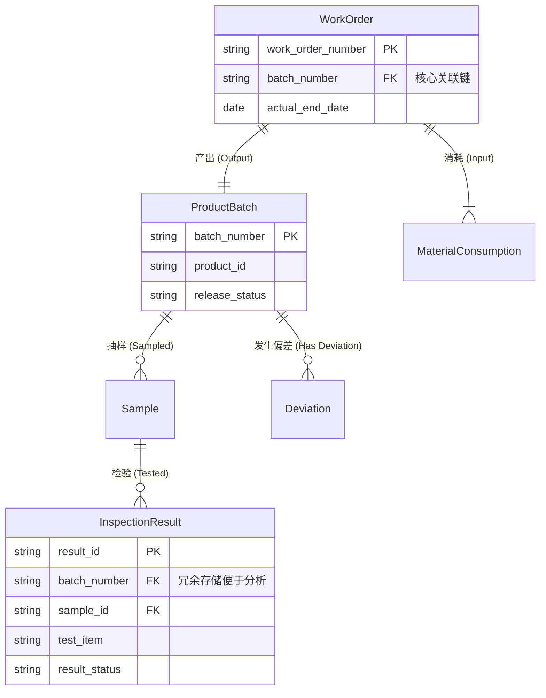

### 1. 核心链路贯通与 ER 结构

我们将 **Work Order (工单)** 作为物理执行的核心，将 **Batch Number (批号)** 作为质量放行的核心。

**核心逻辑：**
*   **One-to-One/Many**: 1个工单 (`work_order`) 产出 1个主要产品批次 (`batch_number`)。
*   **Many-to-One**: 多个检验记录 (`inspection_results`) 和偏差 (`deviations`) 汇总归属于 1个批次。
*   **Chain**: `Material` -> `Work Order` -> `Product Batch` -> `Market/Customer`。

**ER 结构图 (Mermaid):**



### 2. 层级设计 (Layer Design)

*   **Staging Layer (基础清洗)**:
    *   `stg_work_order`: 来源 MES，标准化工单状态与时间。
    *   `stg_inspection_result`: 来源 LIMS，包含检验值与限度标准。
    *   `stg_material_consumption`: 来源 MES，清洗物料批号。
    *   `stg_deviation`: 来源 QMS，清洗偏差等级与状态。

*   **Intermediate Layer (业务逻辑)**:
    *   **`int_production__batch_genealogy`**: **(核心)** 将工单、投料、产出批次构建成一张完整的谱系表。
    *   **`int_quality__batch_compliance`**: 以批次为粒度，聚合检验合格率、OOS 次数、偏差次数。
    *   **`int_quality__process_capability`**: 计算 Cpk/Ppk 所需的统计指标 (Mean, StdDev)。

*   **Marts Layer (分析应用)**:
    *   **`fct_pqr_annual_batch_summary`**: PQR 报告核心宽表，每一行一个批次，包含生产、质量、放行全貌。
    *   **`fct_pqr_material_quality`**: 物料质量回顾表。

### 3. 关键代码示例

#### Intermediate: 构建批次谱系 (Linking Work Order to Quality)

此模型解决“如何通过工单找到对应的质量数据”的问题。

```sql
-- models/intermediate/int_production__batch_genealogy.sql

with work_orders as (
    select * from {{ ref('stg_work_order') }}
),

-- 聚合该批次的偏差信息
batch_deviations as (
    select 
        batch_number,
        count(*) as deviation_count,
        sum(case when deviation_type = 'Critical' then 1 else 0 end) as critical_deviation_count
    from {{ ref('stg_deviation') }}
    group by batch_number
),

-- 聚合该批次的检验结果
batch_inspections as (
    select
        s.batch_number,
        count(*) as total_tests,
        sum(case when r.result_status = 'Fail' then 1 else 0 end) as failed_tests
    from {{ ref('stg_sample') }} s
    join {{ ref('stg_inspection_result') }} r on s.sample_id = r.sample_id
    group by s.batch_number
)

select
    wo.work_order_number,
    wo.batch_number,
    wo.product_id,
    wo.actual_end_date as manufacture_date,
    
    -- 质量指标关联
    coalesce(bd.deviation_count, 0) as count_deviations,
    coalesce(bi.failed_tests, 0) as count_oos,
    
    -- 衍生合规状态
    case 
        when coalesce(bd.critical_deviation_count, 0) > 0 then 'Critical Issues'
        when coalesce(bi.failed_tests, 0) > 0 then 'OOS Observed'
        else 'Right First Time'
    end as compliance_status

from work_orders wo
left join batch_deviations bd on wo.batch_number = bd.batch_number
left join batch_inspections bi on wo.batch_number = bi.batch_number
```

#### Marts: PQR 年度批次汇总宽表

```sql
-- models/marts/pqr/fct_pqr_annual_batch_summary.sql

with genealogy as (
    select * from {{ ref('int_production__batch_genealogy') }}
)

select
    -- 维度
    work_order_number,
    batch_number,
    product_id,
    manufacture_date,
    
    -- 事实指标
    count_deviations,
    count_oos,
    
    -- 用于 Cpk 分组
    extract(year from manufacture_date) as review_year,
    compliance_status

from genealogy
```

### 4. Schema 定义示例

```yaml
# models/marts/pqr/schema.yml
version: 2

models:
  - name: fct_pqr_annual_batch_summary
    description: "PQR报告核心事实表：以工单/批次为粒度的全生命周期汇总"
    columns:
      - name: work_order_number
        description: "生产工单号"
        tests:
          - unique
          - not_null

      - name: batch_number
        description: "产品批号"
        tests:
          - not_null
          - relationships:
              to: ref('stg_work_order')
              field: batch_number

      - name: count_deviations
        description: "关联的偏差数量"
        tests:
          - dbt_utils.expression_is_true:
              expression: ">= 0" 
```

### 5. 缺口分析 (Gap Analysis)

为了完整生成报告，当前模型与数据源存在以下缺口：

| 报告章节 | 缺失内容 | 补充建议 |
|---|---|---|
| **§9.2 关键工艺参数 (CPP)** | 缺少工艺参数的标准范围 (Min/Max) 用于判定是否超标。 | 建立 `seed_process_limits` (CSV)，定义每个产品+工序的标准范围。 |
| **§15 稳定性考察** | 缺少稳定性考察的时间点数据 (T0, T3, T6等)。 | 需接入 LIMS 稳定性模块，建立 `stg_stability_study` 和 `fct_stability_results`。 |
| **§5.3 供应商审计** | 缺少供应商审计记录与评分。 | 需从 QMS 或 SRM 接入 `stg_supplier_audit`。 |
| **§23 投诉与退货** | 缺少投诉与退货的具体明细表。 | 需接入 CRM/ERP 的投诉退货模块，并确保能关联到 `batch_number`。 |
