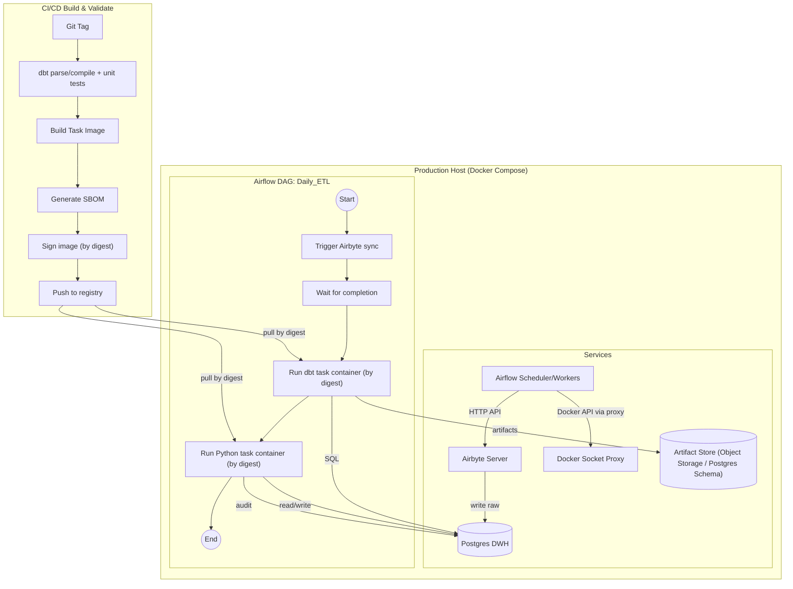

## 1. 目标、边界与假设

本方案面向 QRS（dbt on Postgres）在 GxP 场景下的生产化运行，核心目标是：

- 可复现：同一版本输入与同一版本代码可重复得到一致输出
- 可追溯：每次运行可追溯到镜像版本/源码版本/dbt 产物/输入数据范围
- 可控：最小权限、密钥可轮换、运行域边界清晰
- 可落地：在 Docker Compose 单机生产运行域即可稳定运行，并可平滑演进到 K8s

边界说明：

- 抽取同步使用 Airbyte（或同类工具），dbt 负责转换与建模
- Python 计算仅用于 dbt 不适合承载的算法型逻辑，并以幂等、可审计为前提
- 数据仓库为 Postgres

---

## 2. 关键设计原则（GxP 必备）

- 不可变运行单元：dbt + Python 以 Task Image 形式固化，生产环境只“拉取并运行”指定镜像
- 最小权限：调度器与执行器分离；任务容器仅获取必要的数据库权限
- 密钥不入代码、不入镜像：运行时注入；集中管理并可轮换
- 产物留存：dbt artifacts、运行日志摘要、镜像 digest、输入水位线、输出行数等写入审计
- 幂等与可重跑：每个任务可安全重试；输出表写入采用 upsert/merge 或分区覆盖策略

---

## 3. 系统架构与流程图（Mermaid）



关键变化点：

- 生产运行中拉取镜像优先使用 digest（不可变），tag 仅用于人类阅读
- 不直接暴露宿主机 docker.sock 给 Airflow Worker，改为 Docker Socket Proxy 限制 API 面
- dbt 产物与运行审计独立留存（对象存储或数据库 schema）

---

## 4. 组件对接与运行方式

### 4.1 Airflow 触发 Airbyte

- 通过 Airflow Airbyte Provider 调用 Airbyte API 触发同步
- 连接信息通过 Airflow Connection 管理，不写入 DAG 代码

### 4.2 Airflow 运行 dbt / Python

推荐两种方式（优先级从高到低）：

- 方案 A：KubernetesPodOperator（若未来上 K8s）
- 方案 B：DockerOperator + Docker Socket Proxy（单机 Compose 场景）

约束：

- 禁用 `network_mode=host`
- Task Container 与 Postgres 使用同一 Compose 网络的 DNS 名称通讯
- 任务容器通过环境变量拿到连接信息或只读挂载 profiles 文件

---

## 5. 密钥与配置注入（替换明文写法）

### 5.1 数据库与外部系统凭据

- Postgres 用户与权限分层：raw 写入用户、dbt 转换用户、Python 写入用户可拆分
- Airflow Connection/Secret Backend 作为唯一密钥入口
- 任务容器只接收任务运行所需的最小集合变量

### 5.2 dbt profiles 注入（不入镜像）

推荐做法：

- `profiles.yml` 作为只读文件由运行时挂载到容器内
- 或者使用环境变量驱动的 profiles 模板，在容器启动时渲染到临时目录

建议目标划分：

- dev：个人 schema（带 schema suffix），可并行开发
- uat：共享验证 schema
- prod：固定 schema 与角色权限

---

## 6. dbt 执行策略与产物留存

### 6.1 执行命令

默认建议将生产例行作业拆为两类：

- Daily：`dbt build --select tag:daily --target prod`
- Full-Validation：`dbt build --target prod`（低频或变更窗口）

### 6.2 artifacts 留存

每次 dbt 运行需要留存至少：

- manifest.json
- run_results.json
- sources.json（如启用）

留存位置二选一：

- 对象存储（推荐）：按 `project/env/date/dag_run_id/` 分区存放
- 数据库 schema：以 bytea/jsonb 形式存储并带索引字段（invocation_id、model_unique_id）

---

## 7. Python 增量计算：口径纠正与幂等写入

### 7.1 增量输入口径

若要基于 dbt snapshot 的变更实现增量，输入应来自 snapshot 表（`snap_*`），再映射到下游计算所需的业务键。

推荐水位线字段：

- `dbt_valid_from` 作为变更起点
- `dbt_valid_to is null` 作为当前版本筛选

### 7.2 幂等输出策略

输出表建议采用：

- 业务键 + 计算版本（或有效期）作为唯一约束
- 使用 Postgres `insert ... on conflict ... do update` 做 upsert

审计表必须记录每次运行的状态，失败也要落库，至少包含：

- dag_id、task_id、run_id、try_number
- started_at、ended_at、status、error_summary
- image_digest、git_sha
- input_high_watermark、output_rows
- dbt_invocation_id（若 Python 依赖 dbt 输出）

---

## 8. 审计与合规落库模型（建议字段）

建议两张表：

- `audit.pipeline_run`：一次 DAG Run 的总审计（跨任务汇总）
- `audit.task_run`：每个任务实例的细粒度审计（dbt/python/ingestion）

最小字段集合（task_run）：

- run_key（dag_run_id + task_id + try_number）
- started_at、ended_at、status
- image_digest、git_sha
- input_watermark、output_rows
- artifact_location（若有）
- error_code、error_summary

---

## 9. CI/CD：从“伪代码”到可执行约束

推荐将 CI 分层，避免 CI 依赖生产数据库：

- 静态与编译层：dbt parse/compile、SQL lint（可选）、Python 单元测试
- 集成层：临时 Postgres service + 最小 raw fixtures（或 seeds）跑 `dbt build --select tag:ci`
- 发布层：按 tag 构建镜像、生成 SBOM、按 digest 签名、推送仓库

必须保证：

- 镜像依赖版本锁定（requirements lock 或等价机制）
- 产物（测试报告、artifacts、SBOM、签名材料）可留存与追溯

---

## 10. 落地清单（最小闭环）

- 生产运行域 Compose：Postgres + Airflow + Airbyte + Docker Socket Proxy
- Task Image：dbt runner（包含 qrs 项目）与 Python runner（可同镜像不同 entrypoint）
- 密钥管理：Airflow Connection/Secret Backend 或 Compose secrets
- dbt profiles：运行时挂载并区分 env target
- 审计表：task_run/pipeline_run 两表与最小字段集
- artifacts 留存：对象存储或数据库 schema

---

## 11. 附录：参考配置文件

参考配置放在：

- `docs/dev/docker/`

包含：

- `docker-compose.prod.sample.yml`：生产运行域 Compose 示例（含 docker_socket_proxy）
- `task-image.Dockerfile`：dbt Task Image 构建示例（复制 `qrs/` 并在构建阶段执行 `dbt deps`）
- `profiles.sample.yml`：profiles 示例（通过环境变量注入连接信息）

示例构建命令：

```bash
docker build -f docs/dev/docker/task-image.Dockerfile -t qrs-dbt-task:dev .
```

示例运行命令（挂载 profiles）：

```bash
docker run --rm \
  -v "$(pwd)/docs/dev/docker/profiles.sample.yml:/app/profiles/profiles.yml:ro" \
  -e DBT_HOST=pg_dwh -e DBT_USER=dbt_user -e DBT_PASSWORD=... -e DBT_DBNAME=dwh \
  qrs-dbt-task:dev \
  bash -lc "cd /app/qrs && dbt debug --target prod"
```
